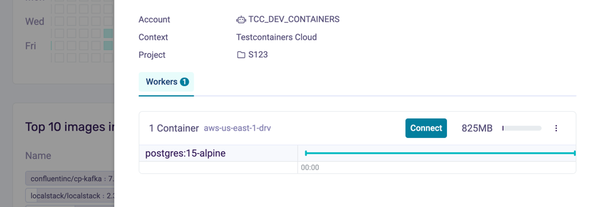
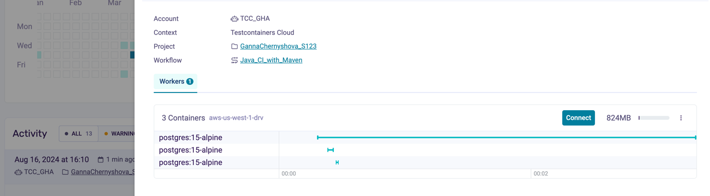

# Testcontainers Cloud demo application

1. Create a codespace workspace on the main 
2. To demo the local development use case run the application locally letting Spring Boot and Testcontainers set up a database for it: `./mvnw spring-boot:test-run`
3. Open the application in the browser: [link](http://localhost:8080/?http://localhost:8080/todos)
4. Enter `todos` in the Todo-Backend API root field, and explore the UI. The application runs on the codespaces VM instance with a Postgres container on TCC.
5. Open [Testcontainers Cloud dashboard](https://app.testcontainers.cloud/dashboard) and see the database instance created for the application
6. Highligt that you can [tag Project (S123) and Account](https://testcontainers.com/cloud/docs/#tag-test-sessions-by-project). In this example via env variables in the devcontainer.js 
` "containerEnv": {
    "TC_CLOUD_TOKEN": "${localEnv:TC_CLOUD_TOKEN}",
    "TCC_PROJECT_KEY": "S123"
  }` 
7. Connect to the cloud worker 
8. Do `docker ps` and see the database container running
* Optional: 
* get into postgers container `docker exec -it mypostgrescontainer sh` 
* login to postgres db`psql -h localhost -p 5432 -U test -d test`
* list tables `\dt`, or any other sql command
* `exit` container
9. Stop the application by `Ctr+C` in the terminal
10. Run application tests by `./mvnw clean test`
11. Go to the [Testcontainers Cloud dashboard](https://app.testcontainers.cloud/dashboard), explore containers started for the tests and then exited
12. Ask about Private registries and [show how to use them with Testcontainers Cloud](https://app.testcontainers.cloud/dashboard/settings)
13. Tell about Service accounts and how to [run Testcontainers test in CI with Testcontainers Cloud](https://www.testcontainers.cloud/ci)
14. Go to the latest [GHA build](https://github.com/GannaChernyshova/S123/actions), rerun the job, and see CI build with the proper Project, Workflow, and Service account 
15. [Testcontainers Cloud pricing](https://www.testcontainers.cloud/pricing)

